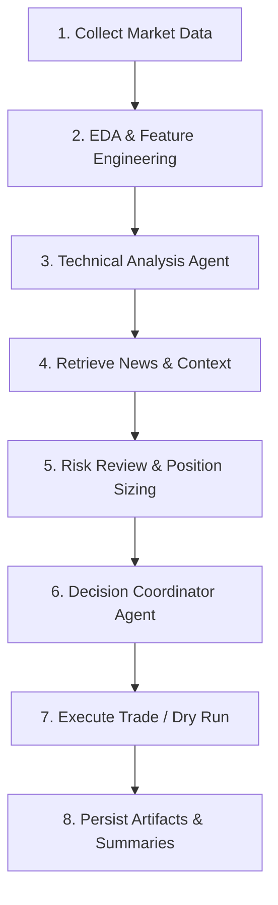

# 📈 Agentic AI Workflow for Automated Trading

`fresh_simple_trading_project` is a standalone Python trading workflow that combines deterministic market analysis with LLM-based review agents. 

It is designed to be highly modular, supporting both live trading and historical backtesting, with optional cloud integration.

## ✨ Key Features

- **Automated Trading Loop**: Live hourly workflow execution with Alpaca market data and optional order submission.
- **Backtesting & Replay**: Hourly historical replay backtests using Alpaca historical bars.
- **Data Enrichment**: Alpha Vantage indicator snapshots and news enrichment.
- **Flexible Storage**: Local (SQLite/Disk) or Azure-backed (Azure SQL/Blob) artifact persistence.
- **Cloud Ready**: Includes an Azure Function App that starts a VM and dispatches the trading CLI remotely.

This project lives inside the repository as its own installable package (`fresh_simple_trading_project`), providing the console entry point `fresh-trader`.

---

## 🔄 Workflow Overview

Each trading iteration follows a structured, agentic pipeline:



**Runtime Behaviors:**
- **Live Mode**: Requires Alpaca credentials. Uses real-time Alpaca market, account, and order APIs.
- **Backtest Mode**: Replays hourly checkpoints from historical Alpaca OHLCV bars using a simulated account.
- **LLM Integration**: At least one LLM key is required. DeepSeek is the primary client; OpenAI acts as a fallback.
- **Alpha Vantage**: Generates indicator snapshots and enriches data with news (when configured).

---

## 🚀 Quick Start & Installation

### Prerequisites
- Python 3.11+
- `pip`
- **API Keys**:
  - Alpaca (Paper trading credentials)
  - LLM (DeepSeek or OpenAI)
  - Alpha Vantage (Optional but recommended)

### 1. Install Package
Create a virtual environment and install the package in editable mode:

```bash
cd fresh_simple_trading_project
python3 -m venv .venv
source .venv/bin/activate
python -m pip install --upgrade pip

# Core installation (Development)
python -m pip install -e ".[dev]"

# (Optional) With Azure support
python -m pip install -e ".[dev,azure]"

# (Optional) Full environment for notebooks/experiments
python -m pip install -r requirements.txt
```

### 2. Configure Environment
Copy the sample environment file and provide your API keys:

```bash
cp .env.example .env
```

**Minimum `.env` configuration:**
```dotenv
TRADING_SYMBOL=AAPL
RUN_MODE=live

# Alpaca API (Paper Trading)
ALPACA_PAPER_API_KEY=your_alpaca_key
ALPACA_PAPER_SECRET_KEY=your_alpaca_secret
PAPER=true
TRADE_API_URL=https://paper-api.alpaca.markets

# LLM Configuration
DEEPSEEK_API_KEY=your_deepseek_key
OPENAI_API_KEY=your_openai_key # Optional fallback

# Data Providers
ALPHA_VANTAGE_API_KEY=your_alpha_vantage_key
```

*(See [Configuration Reference](#️-configuration-reference) below for advanced settings).*

---

## 💻 CLI Usage (`fresh-trader`)

After installation, the `fresh-trader` CLI becomes available. 

### Single Iteration (`trade-once`)
| Goal | Command |
|------|---------|
| **Live Dry Run** | `fresh-trader trade-once --mode live --symbol AAPL` |
| **Live Order Execution** | `fresh-trader trade-once --mode live --symbol AAPL --execute` |
| **JSON Output** | `fresh-trader trade-once --mode live --symbol AAPL --json` |
| **Backtest Checkpoint** | `fresh-trader trade-once --mode backtest --symbol AAPL` |

*Note: In `trade-once`, agent handoffs and reasoning are printed to the console unless `--json` is provided. Orders are only sent on live mode when `--execute` is passed. Backtest mode will automatically simulate fills.*

### Continuous Loop (`run`)
| Goal | Command |
|------|---------|
| **Live Loop** | `fresh-trader run --mode live --symbol AAPL` |
| **Live Loop (Executes trades)** | `fresh-trader run --mode live --symbol AAPL --execute` |
| **Short Demo Run** | `fresh-trader run --mode live --symbol AAPL --max-iterations 2 --sleep-seconds 5` |
| **Backtest Replay** | `fresh-trader run --mode backtest --symbol AAPL --max-iterations 6` |

*Note: The live loop processes completed hourly checkpoints and automatically stops when the live market closes. Backtesting summaries will be persisted automatically after the loop finishes.*

### Utilities
Fetch Alpha Vantage indicator snapshots:
```bash
fresh-trader alpha-vantage-indicators --symbol AAPL
```

---

## 📂 Storage & Artifacts

By default, runtime outputs are written locally:
- `data/raw/` - Raw bars and news artifacts
- `data/workflow.sqlite` - SQLite result store
- `reports/` - Generated report outputs

### Cloud Storage (Azure)
You can configure the workflow to use Azure for persistence by setting the following in your `.env`:
- `RAW_STORE_PROVIDER=azure_blob`
- `RESULT_STORE_PROVIDER=azure_sql` (Requires `DATABASE_URL`)

*(Note: When running inside Azure Functions, the storage root automatically moves to a temp-backed runtime location unless `FUNCTION_APP_STORAGE_ROOT` is set).*

---

## ☁️ Azure Function App VM Dispatcher

The repository includes a standalone Azure Function App entrypoint (`function_app.py`). It **does not** run the trading workflow directly. Instead, it:
1. Accepts an HTTP or timer trigger.
2. Starts the target Azure VM (if needed).
3. Executes the trading CLI on that VM via Azure VM Run Command.
4. Exposes status and log endpoints for the run.

The start response includes `log_url` and `log_download_url`. Those URLs are generated with
`start_if_needed=true` and `wait_for_running_seconds=90` so opening them right after dispatch is less
likely to fail while the VM is still transitioning to `running`.

### Browser-friendly GET routes

The Function App exposes these HTTP routes:

- `GET|POST /api/trading/vm/start`
- `GET /api/trading/vm/status`
- `GET /api/trading/vm/log`
- Compatibility aliases: `/api/trading/session/start`, `/api/trading/session/status`, `/api/trading/session/log`

Use `?code=<FUNCTION_KEY>` in the URL when opening these routes in a browser.

**Trigger a backtest run with GET:**

```text
https://<FUNCTION_APP_NAME>.azurewebsites.net/api/trading/session/start?code=<FUNCTION_KEY>&symbol=AAPL&mode=backtest&loops=1
```

**Check current status:**

```text
https://<FUNCTION_APP_NAME>.azurewebsites.net/api/trading/session/status?code=<FUNCTION_KEY>
```

**Read the latest log tail:**

```text
https://<FUNCTION_APP_NAME>.azurewebsites.net/api/trading/session/log?code=<FUNCTION_KEY>
```

**Download a specific VM log file:**

```text
https://<FUNCTION_APP_NAME>.azurewebsites.net/api/trading/session/log?code=<FUNCTION_KEY>&log_file_path=<URL_ENCODED_LOG_FILE_PATH>&download=true
```

If the VM is still booting or already stopped, the generated `log_url` and `log_download_url` include
`start_if_needed=true` and `wait_for_running_seconds=90` so they can wait for the VM to become ready.

The start/status payload may also include these Blob Storage fallback fields:

- `blob_log_url`: direct blob path for the uploaded log file
- `blob_log_share_url`: shareable blob URL to send to other people

Use `blob_log_share_url` if direct VM log access is unavailable and the log has already been uploaded to Blob Storage.

**Build Deployment Bundle:**
```bash
./scripts/build_function_app_package.sh
```
*(For full Function App setup instructions, see `function_app.README.md`).*

---

## 🧪 Testing & Development

Run the entire test suite:
```bash
python -m pytest tests
```
Run specific suites:
```bash
python -m pytest tests/test_cli.py tests/test_config.py
```

> **⚠️ Disclaimer:** This is a research/demo trading workflow, not a production-hardened trading system. Keep it on paper accounts until you have validated the behavior you want.

---

## ⚙️ Configuration Reference

| Environment Variable | Purpose | Default |
| --- | --- | --- |
| `TRADING_SYMBOL` | Default ticker symbol | `AAPL` |
| `RUN_MODE` | Workflow mode (`live` / `backtest`) | `live` |
| `LIVE_SLEEP_SECONDS` | Delay between live loop iterations | `3600` |
| `BACKTEST_SLEEP_SECONDS` | Delay between backtest replays | `1` |
| `LIVE_MARKET_DATA_PROVIDER`| Live market data provider | `alpaca` (auto) |
| `RAW_STORE_PROVIDER` | Raw artifact storage backend | `local` |
| `RESULT_STORE_PROVIDER` | Result storage backend | `sqlite` |
| `DATABASE_URL` | SQLAlchemy URL for result storage | (local SQLite path) |
| `DEEPSEEK_MODEL` | Primary DeepSeek model | `deepseek-reasoner` |
| `OPENAI_MODEL` | Secondary OpenAI model | `gpt-5.4-mini` |
| `LLM_SHOW_PROGRESS` | Print heartbeat messages during LLM calls | `true` |
| `NEWS_MAX_AGE_DAYS` | Max age for retained news articles | `7` |
| `FUNCTION_APP_STORAGE_ROOT`| Override runtime storage root | (unset) |

*Azure-specific variables (`AZURE_SUBSCRIPTION_ID`, `AZURE_VM_RESOURCE_GROUP`, `AZURE_VM_NAME`) are only needed for the Function App VM dispatcher.*
