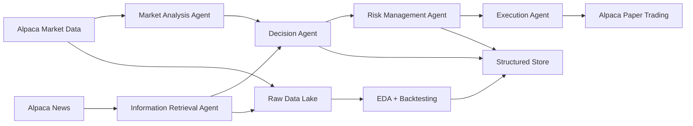

# Architecture

## Workflow Diagram

## Module Mapping

- `MarketAnalysisAgent`
  - Reuses the Alpaca example strategy logic: RSI, MACD, and 50/100/200 moving averages.
  - Produces entry/exit setup flags and the latest technical state.
- `InformationRetrievalAgent`
  - Pulls recent headlines and article content through Alpaca News.
  - Adds simple keyword-based risk flags without overriding the source strategy yet.
- `DecisionAgent`
  - Converts technical state and retrieval context into `BUY`, `SELL`, or `HOLD`.
  - Keeps the live order rules aligned to the Alpaca reference strategy.
- `RiskManagementAgent`
  - Applies the same buying-power cap used in the Alpaca example.
  - Prevents entry when the market is closed or position size collapses to zero.
- `ExecutionAgent`
  - Uses Alpaca paper-trading market orders.
- `TradingWorkflow`
  - Orchestrates data collection, analysis, retrieval, decisioning, logging, and persistence.
  - Supports one-shot execution and an hourly loop.

## Why This Counts As Agentic

The system is structured as cooperating specialist agents with separate responsibilities and state handoffs. It does not yet introduce an LLM planner because the supplied Alpaca resources do not justify that extra behavior. The current design keeps a clean seam where a future LLM or policy model could consume the same market, news, and risk context.

